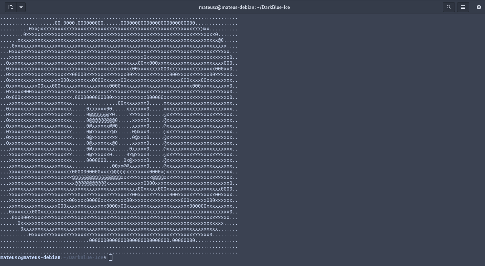

## DarkBlue Ice for gnome terminal


### A Beautiful theme for gnome terminal with Dark blue and ice colors distributed in a harmonic way.

---

## Working

* Installl the `material-theme-profile.dconf` on [github releases](https://github.com/Dedsd/DarkBlue-Ice-for-gnome-terminal/releases)
* Execute the following command in the terminal:
```
dconf load /org/gnome/terminal/legacy/profiles:/:b1dcc9dd-5262-4d8d-a863-c897e6d979b9/ < ~/Downloads/material-theme-profile.dconf
```

* Make shure your profile id is correct and the `material-theme-profile.dconf` is in downloads.

* Now your gnome terminal looks amazing with the DarkBlue Ice theme!

---

Made by [Mateus Cavalcanti](https://github.com/Mateus-Cavalcanti)